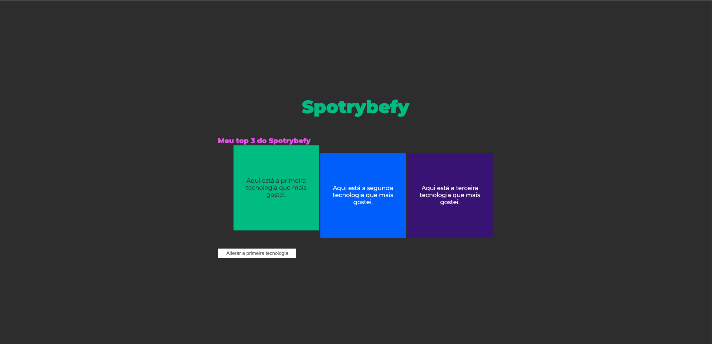

# Exercício de Eventos e Manipulação do DOM

Este projeto é um exercício prático de manipulação do DOM (Document Object Model) e uso de eventos em JavaScript puro. O objetivo foi explorar como interagir com elementos HTML, responder a ações do usuário e modificar dinamicamente o conteúdo da página.

---

## 🚀 O que foi feito neste exercício?

Neste exercício, aprendi e pratiquei os seguintes conceitos:

### 1. **Seleção Dinâmica de Tecnologia**
   - Implementei uma funcionalidade que permite ao usuário selecionar um item de uma lista clicando nele.
   - Apenas um item pode estar "selecionado" por vez, e a seleção é destacada com a classe `tech`.
   - Ao selecionar um novo item, o anterior é automaticamente desmarcado.

### 2. **Atualização de Texto em Tempo Real**
   - Criei um campo de texto que, ao ser preenchido, atualiza dinamicamente o conteúdo do item selecionado na lista.
   - Isso permite que o usuário edite o texto dos itens de forma interativa.

### 3. **Redirecionamento ao Clicar no Título**
   - Adicionei um evento ao título da página que, ao ser clicado, redireciona o usuário para uma página externa (neste caso, a documentação de eventos do JavaScript na W3Schools).
   - O redirecionamento é feito em uma nova guia para não interromper a experiência do usuário na página atual.

### 4. **Efeito de Cor Aleatória ao Passar o Mouse**
   - Implementei um efeito visual em que a cor do título da página muda aleatoriamente quando o usuário passa o mouse sobre ele.
   - As cores são geradas dinamicamente em formato RGB, criando uma experiência interativa e divertida.

### 5. **Reinicialização de Texto ao Clicar Duas Vezes**
   - Adicionei uma funcionalidade que permite ao usuário reiniciar o texto de um item da lista ao clicar duas vezes nele.
   - Isso é útil para "resetar" o conteúdo de um item de forma rápida e intuitiva.

---

## 💻 Estrutura do Projeto

O projeto consiste em três arquivos principais:

- **index.html**: Contém a estrutura básica do HTML, incluindo a lista de itens, o campo de input e o título da página.
- **style.css**: Contém os estilos aplicados aos elementos, como cores, fontes e espaçamentos.
- **main.js**: Contém toda a lógica de manipulação do DOM e tratamento de eventos.

---

## 📌 Dicas e Observações

- Aprendi a importância de usar `event.target` para identificar o elemento que disparou um evento.
- Explorei a manipulação de classes CSS com `classList.add` e `classList.remove` para destacar elementos dinamicamente.
- Utilizei métodos como `window.open` para redirecionar o usuário e `Math.random` para gerar cores aleatórias.
- Pratiquei a limpeza de campos de input após interações do usuário para melhorar a experiência.

---

## 🌟 Recursos Úteis

- [Documentação do MDN sobre DOM](https://developer.mozilla.org/pt-BR/docs/Web/API/Document_Object_Model)
- [Guia de Markdown](https://www.markdownguide.org/)
- [JavaScript.info - Manipulação do DOM](https://javascript.info/document)

---

## 🖼️ Imagem do exercício

Feito por **Everton Balland** ☘️
